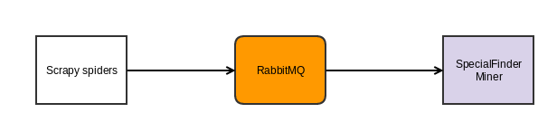

# SpecialFinderCrawler
A crawler scraps sites I am interested in and puts results into a RabbitMQ queue for [SpecialFinderMiner](https://github.com/janusle/SpecialFinderMiner) to analyse.

## Architecture



### Techincal stack:
[Scrapy](http://scrapy.org/)

### Development:

```bash
$ pip install -r requirements.txt
```

### Run crawlers:

```bash
$ cd crawlers
Run a specific crawler
$ scrapy crawl {{ crawler name }} -s {{ settings }}
For example:
$ scrapy crawl coles -s CLOSESPIDER_PAGECOUNT=5
```

### Deployment:

Currently I host it on [Scrapinghub](scrapinghub.com)
```bash
$ cd crawlers && shub deploy
```
